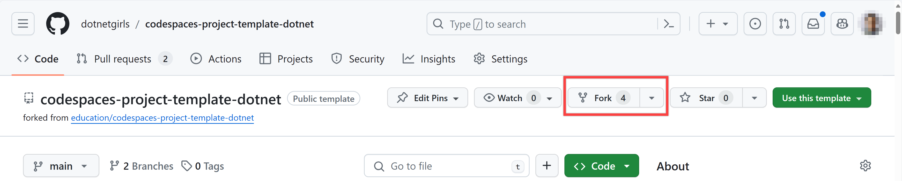

# Prepare your development environment

In this workshop, we will be using [GitHub Codespaces](https://docs.github.com/codespaces/overview).

What is GitHub Codespaces? It's a development environment that's hosted in the cloud. It allows you to develop entirely in the cloud, without needing to install anything on your local machine. It's like Visual Studio Code, but in the cloud.

With GitHub Codespaces, you can create a new development environment in seconds, and start coding right away. You can also share your development environment with others, and collaborate in real-time.

OK. Let's get started!

## Step 1: Fork the GitHub repository

1. First, you need to fork this repository to your GitHub account. To do that, click the "Fork" button at the top-right corner of this page.

    

1. You will see the screen below. Select your GitHub account, and click the "Create fork" button.

    

1. After forking the repository, you will be redirected to your forked repository.

    

You have forked the repository to your GitHub account. Now, you can start coding in GitHub Codespaces.

## Step 2: Open the repository in GitHub Codespaces

1. To open the repository in GitHub Codespaces, click the "Code" button at the top-right corner of the repository, and click the "Create codespace on main" button.

    

1. Wait for a few minutes. GitHub initialises the new codespace instance for you. Depending on your network status, it might take 5-10 minutes.

    

1. Your codespace instance is ready when you see the screen below.

    

1. In the terminal, enter the following command to see whether your codespace has a proper repository setup.

    ```bash
    git remote -v
    ```

    You should see the output like below.

    ```bash
    origin  https://github.com/{{YOUR_GITHUB_ID}}/workshop-portfolio (fetch)
    origin  https://github.com/{{YOUR_GITHUB_ID}}/workshop-portfolio (push)
    upstream    https://github.com/dotnetgirls/workshop-portfolio (fetch)
    upstream    https://github.com/dotnetgirls/workshop-portfolio (push)
    ```

1. In the terminal, enter the following commands to see whether your codespace is ready for app development.

    ```bash
    dotnet --list-sdks
    ```

1. You should see the .NET SDK version `6.x`, `7.x` and `8.x` like below. The last 3 digit might be different from what you see, but the first digit should be `6`, `7` and `8`.

    ```bash
    6.0.420 [/usr/share/dotnet/sdk]
    7.0.407 [/usr/share/dotnet/sdk]
    8.0.202 [/usr/share/dotnet/sdk]
    ```

1. Make sure you're in the repository root directory.

    ```bash
    cd $CODESPACE_VSCODE_FOLDER
    echo $CODESPACE_VSCODE_FOLDER
    ```

---

Congratulations! You have created a new codespace instance. Now, you can start coding in the cloud.

:point_right: [Step 1: Create a new Blazor WebAssembly application](./01-blazor-new.md)
