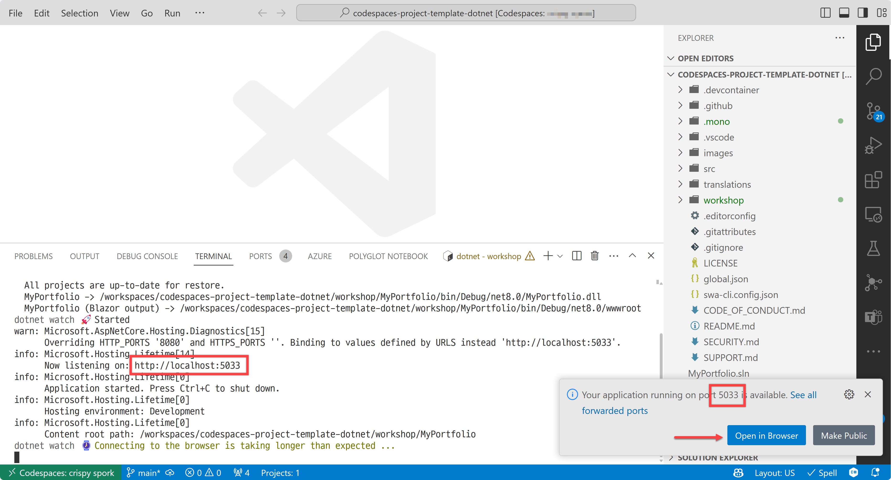

# Create a new Blazor WebAssembly application

In this step, you will create a new [Blazor WebAssembly](https://learn.microsoft.com/aspnet/core/blazor/hosting-models#blazor-webassembly) application using the `dotnet` command-line interface (CLI).

With Blazor WebAssembly, you build a web application purely running on a web browser. It's a modern single-page application (SPA) framework that runs on WebAssembly. It's a new way to build interactive client-side web UI with .NET.


👉 Image source: [Microsoft](https://learn.microsoft.com/aspnet/core/blazor/hosting-models#blazor-webassembly)

Generally speaking, web frontend UI applications rely on JavaScript for user interactions. If you don't know JavaScript, you have to learn it first to build an application. However, if you are a new starter building a web frontend UI application and don't know where to start, this Blazor WebAssembly is a good starting point for you because you only need to know C# and .NET for building both frontend and backend applications.

OK. Let's get started!

## Step 1: Create a new Blazor WebAssembly application

1. In the terminal, enter the following commands to setup the workshop folder. Remember that `$CODESPACE_VSCODE_FOLDER` is the root directory of your codespace workspace.

    ```bash
    cd $CODESPACE_VSCODE_FOLDER
    mkdir workshop
    cd workshop
    ```

1. Enter the following command to create a new Blazor WebAssembly project.

    ```bash
    dotnet new blazorwasm -n MyPortfolio
    ```

1. Enter the following commands to create a solution file and add the Blazor WebAssembly project to the solution.

    ```bash
    dotnet new sln -n MyPortfolio
    dotnet sln add MyPortfolio
    ```

## Step 2: Build and run the Blazor WebAssembly application

1. Make sure you're in the `workshop` directory.

    ```bash
    cd $CODESPACE_VSCODE_FOLDER/workshop
    ```

1. Build your Blazor WebAssembly project to make sure everything is working fine.

    ```bash
    dotnet restore && dotnet build
    ```

1. Run the Blazor WebAssembly project to see the default application.

    ```bash
    dotnet watch run --project MyPortfolio
    ```

1. You should see the popup message like below. Click the "Open in Browser" button to open the default Blazor WebAssembly application in your browser.

    

   The screenshot above shows the port number of `5033`, but it might be different from yours.

1. The default Blazor WebAssembly application is open, and should look like below.

    

   The web application's URL should look like `https://{{your-github-codespace-name}}-5033.app.github.dev`, instead of `https://localhost:5033`, where `5033` is your port number, which might be different from yours.

1. Stop the running application by pressing `Ctrl + C` in the terminal.

---

Congratulations! You have created a new Blazor WebAssembly application. Let's add some contents by creating a new component in the next step.

:point_right: [Step 2: Create a Home component](./02-home-component.md)
