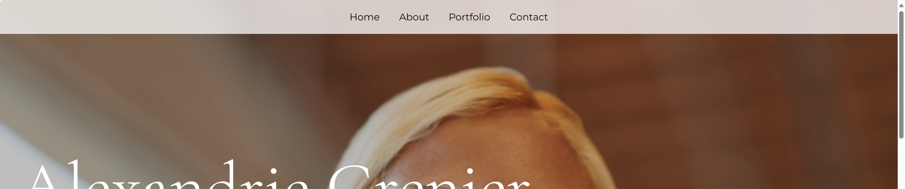

# Add `Header` and `Footer` section

In this step, you will add both header and footer sections. The header section will take care of the site navigation and the footer section will display your social media accounts.

OK. Let's get started!

## Step 0: Restore the Blazor WebAssembly project

If you haven't completed the previous step or want to start from the save point, run the following commands to restore the Blazor WebAssembly project.

```bash
cd $CODESPACE_VSCODE_FOLDER
mkdir -p workshop && cp -a save-points/step-04/. workshop/
cd workshop
```

## Step 1: Add `Header` section to the `Home` component

This header section only contains the navigation link. In addition to that, it needs some unique CSS styling.

1. Open `MyPortfolio/Pages/Home.razor` and add the following content just below the `<PageTitle>My Portfolio</PageTitle>` line:

    ```csharp
    <PageTitle>My Portfolio</PageTitle>
    
    @* ⬇️⬇️⬇️ Add codes below ⬇️⬇️⬇️ *@
    
    <div id="header">
        <a href="#home" target="_top">Home</a>
        <a href="#about" target="_top">About</a>
        <a href="#portfolio" target="_top">Portfolio</a>
        <a href="#contact" target="_top">Contact</a>
    </div>
    
    @* ⬆️⬆️⬆️ Add codes above ⬆️⬆️⬆️ *@
    
    <section class="dark" id="home">
    ```

1. Add the following content just below the `<PageTitle>My Portfolio</PageTitle>` line:

    ```css
    <PageTitle>My Portfolio</PageTitle>
    
    @* ⬇️⬇️⬇️ Add codes below ⬇️⬇️⬇️ *@
    
    <style>
      #header {
        position: fixed;
        display: flex;
        justify-content: center;
        gap: 2rem;
        background: rgba(255,255,255,0.75);
        padding: 1rem;
        top: 0;
        width: 100%;
        z-index: 10;
      }
    </style>
    
    @* ⬆️⬆️⬆️ Add codes above ⬆️⬆️⬆️ *@
    
    <div id="header">
    ```

## Step 2: Add `Footer` section to the `Home` component

The footer section will display your social media accounts. You can add more social media accounts if you want.

1. Open `MyPortfolio/Pages/Home.razor` and add the following content just above the `@code {` line:

    ```csharp
    </section>
    
    @* ⬇️⬇️⬇️ Add codes below ⬇️⬇️⬇️ *@
            
    <div id="contact" style="background-color: #4E567E;">
        @if (property is null)
        {
            <div style="display: flex; justify-content: center; gap: 2.5rem;">
                <p><em>Loading...</em></p>
            </div>
        }
        else if (icons is not null)
        {
            <div style="display: flex; justify-content: center; gap: 2.5rem;">
                @if (string.IsNullOrWhiteSpace(property.Email) is false)
                {
                    <a href="mailto:@(property.Email)">
                        
                    </a>
                }
                @if (string.IsNullOrWhiteSpace(property.LinkedIn) is false)
                {
                    <a href="https://linkedin.com/in/@(property.LinkedIn)" target="_blank" rel="noopener noreferrer">
                        
                    </a>
                }
                @if (string.IsNullOrWhiteSpace(property.GitHub) is false)
                {
                    <a href="https://github.com/@(property.GitHub)" target="_blank" rel="noopener noreferrer">
                        
                    </a>
                }
            </div>
            <p class="small" style="margin-top: 0; color: white;">Created by @property.Name</p>
        }
    </div>
    
    @* ⬆️⬆️⬆️ Add codes above ⬆️⬆️⬆️ *@
    
    @code {
    ```

1. Update the `@code { ... }` block to handle this footer section. Replace the `@code { ... }` block with the following code:

    ```csharp
    @code {
        private SiteProperties? property;
        private HeroImage? heroHome;
    
        private AboutMe? aboutMe;
        private HeroImage? heroAboutMe;
    
        private List<Project>? projects;
        private HeroImage? heroPortfolio;
    
        private SocialIcons? icons;
        
        protected override async Task OnInitializedAsync()
        {
            property = await Http.GetFromJsonAsync<SiteProperties>("sample-data/siteproperties.json");
    
            var heros = await Http.GetFromJsonAsync<List<HeroImage>>("sample-data/heroimages.json");
            heroHome = heros.SingleOrDefault(h => h.Name == "home");
    
            aboutMe = await Http.GetFromJsonAsync<AboutMe>("sample-data/aboutme.json");
            heroAboutMe = heros.SingleOrDefault(h => h.Name == "about");
    
            projects = await Http.GetFromJsonAsync<List<Project>>("sample-data/projects.json");
            heroPortfolio = heros.SingleOrDefault(h => h.Name == "portfolio");
    
            icons = await Http.GetFromJsonAsync<SocialIcons>("sample-data/socialicons.json");
        }
    }
    ```

1. The footer section also needs some CSS styling. Add the following content just above the `</style>` tag.

    ```css
      }
      
      /* ⬇️⬇️⬇️ Add codes below ⬇️⬇️⬇️ */
      
      #contact {
        display: flex;
        flex-direction: column;
        align-items: center;
        gap: 2.5rem;
        padding: 5rem 0 3rem;
        width: 100vw;
      }
      
      /* ⬆️⬆️⬆️ Add codes above ⬆️⬆️⬆️ */
    
    </style>
    ```

## Step 2: Add `socialicons.json`

The `socialicons.json` file are base data to display the social media icons. We will add these files to the `wwwroot/sample-data` directory.

1. Make sure you're in the `workshop` directory.

    ```bash
    cd $CODESPACE_VSCODE_FOLDER/workshop
    ```

1. Create both files in the `wwwroot/sample-data` directory by running the following commands or on the codespace workspace on the side.

    ```bash
    touch MyPortfolio/wwwroot/sample-data/socialicons.json
    ```

1. Open `socialicons.json` and add the content as many projects as you want:

    ```json
    {
      "email": "images/socials/envelope.svg",
      "linkedIn": "images/socials/linkedin.svg",
      "gitHub": "images/socials/github.svg"
    }
    ```

1. Your social media accounts will be stored in `siteproperties.json`. Open `siteproperties.json` and replace the content with the following:

    ```json
    {
      "name": "{{your-name}}",
      "title": "{{your-title}}",
      "email": "{{your-email}}",
      "linkedIn": "{{your-linkedin-account}}",
      "gitHub": "{{your-github-account}}"
    }
    ```

## Step 3: Add `SocialIcons` class

Reading JSON data in Blazor is done by creating classes that represent the JSON data. We will create `SocialIcons` class to represent the `socialicons.json` file.

1. Make sure you're in the `workshop` directory.

    ```bash
    cd $CODESPACE_VSCODE_FOLDER/workshop
    ```

1. Create both `SocialIcons` class in the `Models` directory by running the following commands or on the codespace workspace on the side.

    ```bash
    mkdir -p $CODESPACE_VSCODE_FOLDER/workshop/MyPortfolio/Models
    touch MyPortfolio/Models/SocialIcons.cs
    ```

1. Open `SocialIcons.cs` and add the following content:

    ```csharp
    namespace MyPortfolio.Models;
    
    public class SocialIcons
    {
        public string Email { get; set; } = string.Empty;
        public string LinkedIn { get; set; } = string.Empty;
        public string GitHub { get; set; } = string.Empty;
    }
    ```

1. Because `siteproperties.json` has been updated, the `SiteProperties` class should also been updated. Open `SiteProperties.cs` and replace the content with the following:

    ```csharp
    namespace MyPortfolio.Models;
    
    public class SiteProperties
    {
        public string Name { get; set; } = string.Empty;
        public string Title { get; set; } = string.Empty;
        public string Email { get; set; } = string.Empty;
        public string LinkedIn { get; set; } = string.Empty;
        public string GitHub { get; set; } = string.Empty;
    }
    ```

## Step 4: Build and run the Blazor WebAssembly application

1. Make sure you're in the `workshop` directory.

    ```bash
    cd $CODESPACE_VSCODE_FOLDER/workshop
    ```

1. Build your Blazor WebAssembly project to make sure everything is working fine.

    ```bash
    dotnet build
    ```

1. Run the Blazor WebAssembly project to see the updated application on your web browser.

    ```bash
    dotnet watch run --project MyPortfolio
    ```

1. The updated application is open, and should look like below.

    
    

1. Stop the running application by pressing `Ctrl + C` in the terminal.

---

Congratulations! You have added the `Header` and `Footer` sections to the `Home` component. In the next step, you split all the sections into individual components.

:point_right: [Step 6: Split sections into components](./06-split-components.md)
